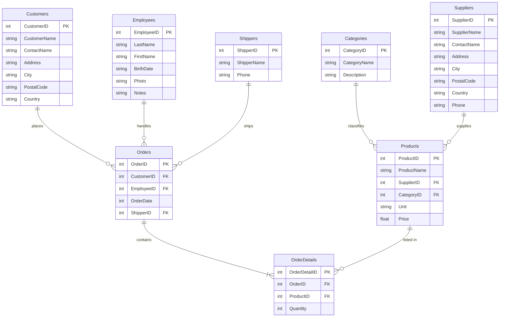

# Data Source

## Origin

The database used in this project was obtained from w3schools:

> **[w3schools SQL Tryit Editor V1.6](https://www.w3schools.com/sql/trysql.asp?filename=trysql_select_all)**

The Northwind database is a sample dataset representing a fictional specialty foods import/export company. It contains transactional data including customers, orders, products, suppliers, employees, and shippers.

---

## Database Overview

The database is composed of **8 tables** with the following record counts:

| Table | Records | Description |
|-------|--------:|-------------|
| `Customers` | 91 | Customer companies and contact details |
| `Categories` | 8 | Product category classifications |
| `Employees` | 10 | Sales staff information |
| `OrderDetails` | 518 | Line items for each order (quantities) |
| `Orders` | 196 | Customer orders with assigned employee and shipper |
| `Products` | 77 | Product catalog with pricing and supplier info |
| `Shippers` | 3 | Shipping companies |
| `Suppliers` | 29 | Product suppliers and contact details |

---

## Entity-Relationship Diagram

The diagram below shows the primary keys (**PK**), foreign keys (**FK**), and relationships between tables.

---

## Table Structures

### `Categories`

| # | Column | Type | Description |
|--:|--------|------|-------------|
| 1 | `CategoryID` | int | **PK.** Unique category identifier |
| 2 | `CategoryName` | str | Name of the product category |
| 3 | `Description` | str | Description of the category |

---

### `Customers`

| # | Column | Type | Nulls | Description |
|--:|--------|------|:-----:|-------------|
| 1 | `CustomerID` | int | 0 | **PK.** Unique customer identifier |
| 2 | `CustomerName` | str | 0 | Company name |
| 3 | `ContactName` | str | 0 | Primary contact person |
| 4 | `Address` | str | 0 | Street address |
| 5 | `City` | str | 0 | City |
| 6 | `PostalCode` | str | 1 | Postal / ZIP code |
| 7 | `Country` | str | 0 | Country |

---

### `Employees`

| # | Column | Type | Description |
|--:|--------|------|-------------|
| 1 | `EmployeeID` | int | **PK.** Unique employee identifier |
| 2 | `LastName` | str | Employee's last name |
| 3 | `FirstName` | str | Employee's first name |
| 4 | `BirthDate` | str | Date of birth (`MM/DD/YYYY`) |
| 5 | `Photo` | str | Filename of employee photo |
| 6 | `Notes` | str | Biographical notes |

---

### `Orders`

| # | Column | Type | Description |
|--:|--------|------|-------------|
| 1 | `OrderID` | int | **PK.** Unique order identifier |
| 2 | `CustomerID` | int | **FK → Customers.** Customer who placed the order |
| 3 | `EmployeeID` | int | **FK → Employees.** Employee who handled the order |
| 4 | `OrderDate` | int | Date the order was placed (serial number format) |
| 5 | `ShipperID` | int | **FK → Shippers.** Shipping company used |

---

### `OrderDetails`

| # | Column | Type | Description |
|--:|--------|------|-------------|
| 1 | `OrderDetailID` | int | **PK.** Unique line-item identifier |
| 2 | `OrderID` | int | **FK → Orders.** Parent order |
| 3 | `ProductID` | int | **FK → Products.** Product in this line item |
| 4 | `Quantity` | int | Number of units ordered |

---

### `Products`

| # | Column | Type | Description |
|--:|--------|------|-------------|
| 1 | `ProductID` | int | **PK.** Unique product identifier |
| 2 | `ProductName` | str | Name of the product |
| 3 | `SupplierID` | int | **FK → Suppliers.** Supplier of this product |
| 4 | `CategoryID` | int | **FK → Categories.** Product category |
| 5 | `Unit` | str | Unit size / packaging description |
| 6 | `Price` | float | Unit price |

---

### `Shippers`

| # | Column | Type | Description |
|--:|--------|------|-------------|
| 1 | `ShipperID` | int | **PK.** Unique shipper identifier |
| 2 | `ShipperName` | str | Shipping company name |
| 3 | `Phone` | str | Contact phone number |

---

### `Suppliers`

| # | Column | Type | Description |
|--:|--------|------|-------------|
| 1 | `SupplierID` | int | **PK.** Unique supplier identifier |
| 2 | `SupplierName` | str | Company name |
| 3 | `ContactName` | str | Primary contact person |
| 4 | `Address` | str | Street address |
| 5 | `City` | str | City |
| 6 | `PostalCode` | str | Postal / ZIP code |
| 7 | `Country` | str | Country |
| 8 | `Phone` | str | Contact phone number |
